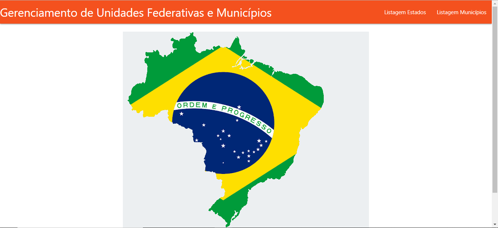

 # Gerenciamento de Unidades Federativas e Municípios

Aplicação Web envolvendo conceitos de CRUD PHP para gerenciar Municípios e Estados, proposto como teste pela [CrediSIS CentralCredi](https://credisis.com.br/central-credi).

## Clonar repositório

`` git clone https://github.com/thiagosr135/teste_credisis.git ``

## Autor
* **Thiago de Souza Ribeiro** - [thiagosr135](https://github.com/thiagosr135)
